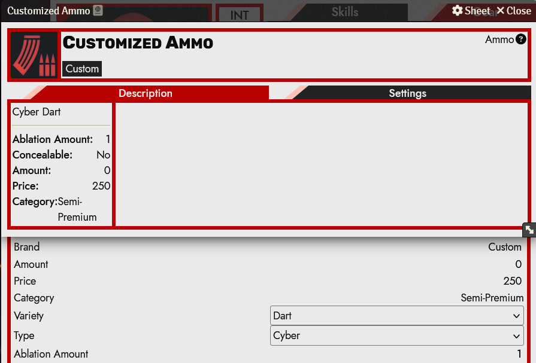
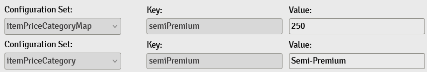

<!--- Downloads @ Latest Badge -->

<!--- Forge Bazaar Install % Badge -->

# Cyberpunk RED System Customizer

If you're a GM who likes to homebrew, maybe you've come up with a cool new
kind of ammunition or a neat piece of clothing that doesn't really fit into
one of the existing types within its category. With this module, you can
customize these aspects of the Cyberpunk RED system and add new item types
within these categories to more accurately represent your homebrew items!

While this module is quite flexible and powerful in its ability to customize
the CPR system, it does not contain a detailed knowledge of *what* is being
customized, so you may have mixed results attempting to change configurations
outside of the recommended set. Using this module may involve some amount
of experimentation, so always make sure to take backups of your world!

If you encounter an issue please feel free to log a Github issue against
this project.

## How to Use

The entire interface for this module lies within the Foundry Settings menu.
To configure customizations for your world, navigate to the module settings
and open the "Customization Configuration" menu. From there, you can add as
many customizations to your world as you would like.

## Recommended Customizations

The customizations listed here have been *lightly* tested and probably won't
break your game. If you're feeling up for it, you can enable "Allow All
Configuration Sets" to enable configuring other aspects of the system. Do so
at your own risk, and be aware things may not behave as you expect.

### Clothing

New clothing styles and clothing types can be added via the `clothingStyle` and
`clothingType` configuration sets respectively. Once added, these will be
available in the settings for clothing items.

### Ammo

Similarly to clothing, new types and varieties can be added via the `ammoType`
and `ammoVariety` sets respectively. Once created, you will have to modify
any weapons you want to be compatible with your new ammo variety.

### Weapons

You can add new weapon types via the `weaponTypeList` configuration set. This
doesn't seem to be very meaningful, since DV tables and skills are still
configured separately.

### Cyberware

You can create new categories for cyberware with the `cyberwareTypeList`
configuration set. When cyberware using the new category is installed into a
character, it will show up under its own heading.

### Item Price

Cyberpunk RED prices not offering enough flexibility for you? You can add a new
price category via the `itemPriceCategory` configuration set. In order for it
to be recognized by the system, you must also add an entry to the
`itemPriceCategoryMap` set with *an identical key* and the minimum value an item
must be to be considered that price category.

For example, to add a category "Semi-Premium" for items costing from 250-499eb,
create an entry in `itemPriceCategory` with key `semiPremium` and value
`Semi-Premium`. Then, using that same key `semiPremium`, create an entry in the
`itemPriceCategoryMap` and the minimum numeric value `250` as the value.

### Skills

While the system already supports custom skills via Skill items, by default
these cannot be used e.g. as weapon skills, and they must be placed into an
existing skill category. The `skillCategories` configuration set allows you
to create a new skill group for your skills. Skills placed into this category
will then appear in that new category on character sheets. You must also
add this category to `skillCategoriesForWeapons` if you want it to be usable
as a weapon skill.

## Install

Find this in the Foundry module browser or paste
https://github.com/aolkin/cyberpunkred-customizer/releases/latest/download/module.json
into the "Install Module" dialog to get started.

## Changelog

See CHANGELOG.MD
